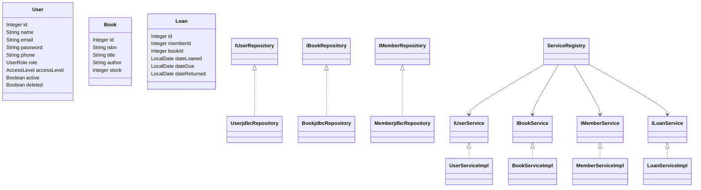
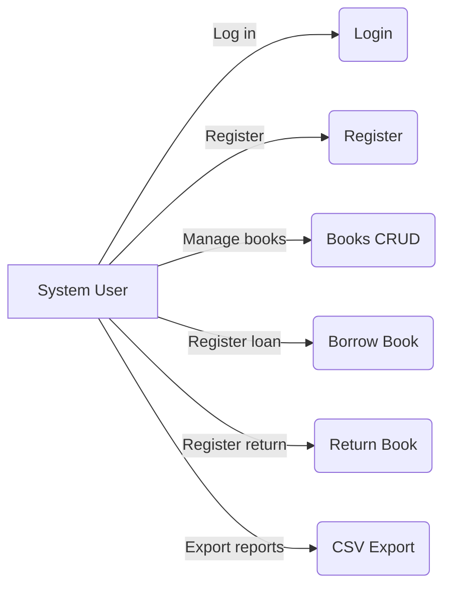

# NovaBook

Library management system (JavaFX + JDBC) with user authentication, loans, and a book catalog. Layered architecture (domain, repository, service, ui) and CSV import/export utilities.

## i. System overview
- Book catalog: create/edit/delete, search, and stock management.
- System users: roles (USER, ADMIN) and access levels (READ_ONLY, READ_WRITE, MANAGE).
- Loans: register loan/return, fine calculation, and export overdue loans.
- Desktop UI with JavaFX: FXML views, controllers, and styles.
- Authentication: Login and Register screens. Passwords stored with BCrypt.

## ii. Prerequisites (Java, Maven, DB)
- Java 17+
- Maven 3.8+
- Database: MySQL 8 (or PostgreSQL if configured in application.properties)
- JDBC driver via Maven (MySQL Connector/J)

## iii. Setup and run
1) Configure the database in application.properties (the one from the classpath is used):
   - Effective file: src/main/resources/application.properties
   - There is also: src/main/sources/application.properties (example). Keep them consistent if you need both.

   Example (MySQL):
   ```
   db.vendor=mysql
   db.host=localhost
   db.port=3306
   db.name=nova_db
   db.user=novA_user
   db.password=A6g9Hj2tQ4r8Pz3X
   db.useSSL=false
   # optional: db.url=jdbc:mysql://localhost:3306/nova_db?serverTimezone=UTC
   ```

   Connection notes (without changing the properties file):
   - If db.url exists, the connection uses it directly.
   - For MySQL with `useSSL=false`, the connection safely adds `allowPublicKeyRetrieval=true` via DriverManager properties (no file changes needed).

2) Build the project:
   ```bash
   mvn -q -DskipTests package
   ```

3) Run with the JavaFX plugin:
   ```bash
   mvn -q javafx:run
   ```
   Alternative (fat JAR):
   ```bash
   java -jar target/novabook-app.jar
   ```

4) Login and Register:
   - On startup, you will see the Login screen.
   - You can go to "Register" to create a user; the password is stored with BCrypt.

## iv. Screenshots
The app uses JavaFX dialogs (Alert). You can replace them with JOptionPane or capture these dialogs. Put screenshots in:
- docs/images/login.png
- docs/images/register.png
- docs/images/error-dialog.png
- docs/images/info-dialog.png

They are referenced in this README as follows:


## v. Class diagrams
Below is a simplified Mermaid diagram of the main classes:


## vi. Use case diagram


## Project structure
- Source code: `src/main/java`
- Resources and configuration: `src/main/resources`
- CSV and working files: `src/main/sources`
- Tests: `src/test/java`

Key packages:
- `com.codeup.novabook.domain` – Entities
- `com.codeup.novabook.repository` – Interfaces and JDBC
- `com.codeup.novabook.service` – Service interfaces
- `com.codeup.novabook.service.impl` – Implementations
- `com.codeup.novabook.ui` – FXML, controllers, styles
- `com.codeup.novabook.infra` – configuration, connections, service registry

## Technical notes
- ConnectionFactory respects `db.url` if present and loads the driver (MySQL/PostgreSQL) without modifying the properties file.
- For MySQL with `useSSL=false` it adds `allowPublicKeyRetrieval=true` as a connection property.
- User registration stores the password with BCrypt.
- The app first opens the Login view and navigates to Main after authentication.

## License
MIT.
