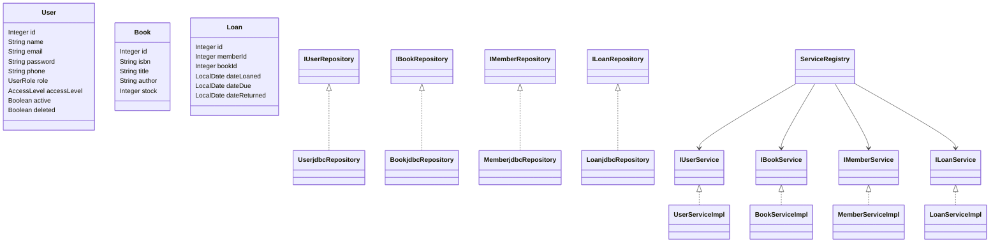
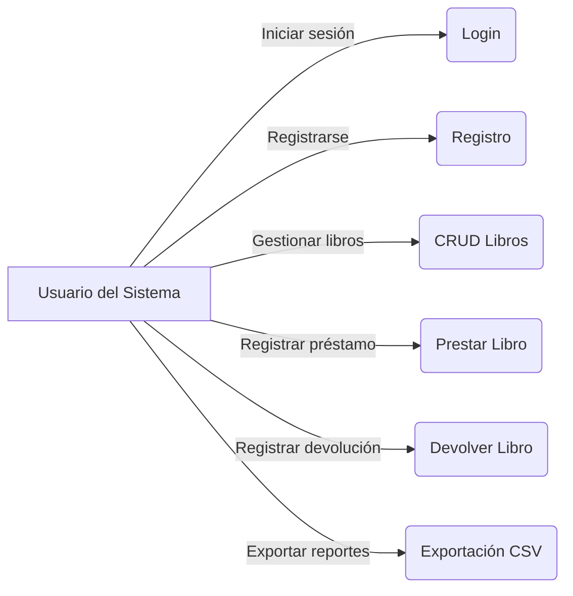

# NovaBook

Sistema de gestión de biblioteca (JavaFX + JDBC) con autenticación de usuarios, préstamos y catálogo de libros. Arquitectura por capas (domain, repository, service, ui) y utilidades de importación/exportación CSV.

## i. Descripción general del sistema
- Catálogo de libros: alta/edición/baja, búsqueda y gestión de stock.
- Usuarios del sistema: roles (USER, ADMIN) y niveles de acceso (READ_ONLY, READ_WRITE, MANAGE).
- Préstamos: registrar préstamo/devolución, cálculo de multas y exportación de préstamos vencidos.
- UI de escritorio con JavaFX: vistas FXML, controladores y estilos.
- Autenticación: pantalla de Login y Registro. Contraseñas almacenadas con BCrypt.

## ii. Requisitos previos (Java, Maven, DB)
- Java 17+
- Maven 3.8+
- Base de datos: MySQL 8 (o PostgreSQL si lo configuras en application.properties)
- Driver JDBC incluido vía Maven (MySQL Connector/J)

## iii. Pasos de configuración y ejecución
1) Configurar la base de datos en application.properties (se usa el del classpath):
   - Archivo efectivo: src/main/resources/application.properties
   - También existe: src/main/sources/application.properties (de ejemplo). Asegúrate de mantenerlos coherentes si lo necesitas.

   Ejemplo (MySQL):
   ```
   db.vendor=mysql
   db.host=localhost
   db.port=3306
   db.name=nova_db
   db.user=novA_user
   db.password=A6g9Hj2tQ4r8Pz3X
   db.useSSL=false
   # opcional: db.url=jdbc:mysql://localhost:3306/nova_db?serverTimezone=UTC
   ```

   Notas de conexión (sin cambiar el properties):
   - Si existe db.url, la conexión la usará directamente.
   - Para MySQL con `useSSL=false`, la conexión añade de forma segura `allowPublicKeyRetrieval=true` vía propiedades de DriverManager (sin tocar el archivo).

2) Construir el proyecto:
   ```bash
   mvn -q -DskipTests package
   ```

3) Ejecutar con el plugin de JavaFX:
   ```bash
   mvn -q javafx:run
   ```
   Alternativa (JAR con dependencias):
   ```bash
   java -jar target/novabook-app.jar
   ```

4) Login y Registro:
   - Al iniciar, verás la pantalla de Login.
   - Puedes ir a "Registrarse" para crear un usuario; la contraseña se almacena con BCrypt.

## iv. Capturas de pantalla de JOptionPane
La aplicación usa diálogos JavaFX (Alert). Puedes sustituirlos por JOptionPane o capturar estos diálogos. Coloca las capturas en:
- docs/images/login.png
- docs/images/register.png
- docs/images/error-dialog.png
- docs/images/info-dialog.png

En este README se referencian así:


## v. Diagramas de Clases
A continuación, un diagrama (Mermaid) simplificado de clases principales:


## vi. Diagrama de Casos de Uso


## Estructura del proyecto
- Código fuente: `src/main/java`
- Recursos y configuración: `src/main/resources`
- CSV y archivos de trabajo: `src/main/sources`
- Tests: `src/test/java`

Paquetes clave:
- `com.codeup.novabook.domain` – Entidades
- `com.codeup.novabook.repository` – Interfaces y JDBC
- `com.codeup.novabook.service` – Interfaces de servicio
- `com.codeup.novabook.service.impl` – Implementaciones
- `com.codeup.novabook.ui` – FXML, controladores, estilos
- `com.codeup.novabook.infra` – configuración, conexiones, registro de servicios

## Notas técnicas relevantes
- ConnectionFactory ahora respeta `db.url` si existe y carga el driver (MySQL/PostgreSQL) sin tocar el properties.
- Para MySQL con `useSSL=false` añade `allowPublicKeyRetrieval=true` como propiedad de conexión.
- Registro de usuarios guarda la contraseña con BCrypt.
- La app abre primero la vista de Login y navega al Main al autenticarse.

## Licencia
MIT.
